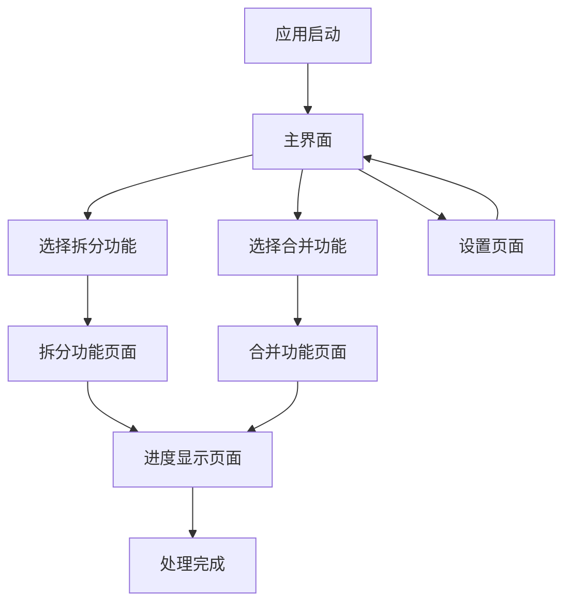

# Excel处理工具桌面应用 - 产品需求文档

## 1. Product Overview

本产品是一个基于现有Python Excel处理脚本的Windows桌面应用，为用户提供直观的图形界面来执行Excel文件的拆分和合并操作。
应用解决了命令行操作复杂、普通用户难以使用的问题，让非技术用户也能轻松处理大型Excel文件的拆分合并需求。
目标是成为Windows平台上最易用的Excel批量处理工具，服务于数据分析师、办公人员等用户群体。

## 2. Core Features

### 2.1 User Roles

本应用面向单一用户类型，无需区分用户角色。所有用户均可使用全部功能。

### 2.2 Feature Module

我们的Excel处理工具包含以下主要页面：
1. **主界面**：功能选择区域、文件操作区域、参数配置区域、操作按钮区域
2. **拆分功能页面**：文件选择、输出目录选择、拆分参数设置、格式保留选项
3. **合并功能页面**：输入目录选择、输出文件设置、格式保留选项
4. **进度显示页面**：处理进度条、日志输出、操作状态显示
5. **设置页面**：应用配置、默认参数设置

### 2.3 Page Details

| Page Name | Module Name | Feature description |
|-----------|-------------|---------------------|
| 主界面 | 功能选择区域 | 提供拆分和合并功能的选择按钮，显示功能说明 |
| 主界面 | 文件操作区域 | 显示当前选择的文件或目录路径，提供浏览按钮 |
| 主界面 | 参数配置区域 | 设置每文件行数、格式保留选项等参数 |
| 主界面 | 操作按钮区域 | 开始处理、重置、退出等操作按钮 |
| 拆分功能页面 | 文件选择 | 浏览并选择要拆分的Excel文件，支持.xlsx格式验证 |
| 拆分功能页面 | 输出目录选择 | 选择拆分后文件的保存目录，自动创建不存在的目录 |
| 拆分功能页面 | 拆分参数设置 | 设置每个文件包含的行数，默认1000行 |
| 拆分功能页面 | 格式保留选项 | 选择基础版本（快速）或格式保留版本（完整格式） |
| 合并功能页面 | 输入目录选择 | 选择包含待合并Excel文件的目录 |
| 合并功能页面 | 输出文件设置 | 设置合并后文件的保存路径和文件名 |
| 合并功能页面 | 格式保留选项 | 选择基础版本（快速）或格式保留版本（完整格式） |
| 进度显示页面 | 处理进度条 | 实时显示文件处理进度百分比和当前处理状态 |
| 进度显示页面 | 日志输出 | 显示详细的处理日志，包括成功和错误信息 |
| 进度显示页面 | 操作状态显示 | 显示当前操作状态，提供取消操作按钮 |
| 设置页面 | 应用配置 | 设置默认输出目录、默认行数等应用偏好 |
| 设置页面 | 默认参数设置 | 配置默认的拆分行数、格式保留选项等 |

## 3. Core Process

**Excel拆分流程**：
用户启动应用 → 选择拆分功能 → 浏览选择Excel文件 → 设置输出目录 → 配置拆分行数 → 选择是否保留格式 → 点击开始拆分 → 查看进度和日志 → 完成后查看结果文件

**Excel合并流程**：
用户启动应用 → 选择合并功能 → 选择包含Excel文件的输入目录 → 设置输出文件路径 → 选择是否保留格式 → 点击开始合并 → 查看进度和日志 → 完成后查看合并结果

## 4. User Interface Design

### 4.1 Design Style

- **主色调**：蓝色系（#2196F3）作为主色，白色（#FFFFFF）作为背景色
- **辅助色**：灰色（#757575）用于次要文本，绿色（#4CAF50）用于成功状态，红色（#F44336）用于错误状态
- **按钮样式**：现代扁平化设计，圆角矩形按钮，悬停时有阴影效果
- **字体**：微软雅黑，主标题16px，正文14px，说明文字12px
- **布局风格**：卡片式布局，左侧功能导航，右侧主要操作区域
- **图标风格**：使用Material Design风格的图标，简洁明了

### 4.2 Page Design Overview

| Page Name | Module Name | UI Elements |
|-----------|-------------|-------------|
| 主界面 | 功能选择区域 | 两个大型功能卡片，包含图标和描述文字，蓝色边框，悬停效果 |
| 主界面 | 文件操作区域 | 文件路径输入框配合浏览按钮，路径显示区域有边框和背景色 |
| 主界面 | 参数配置区域 | 标签化的参数设置区域，数字输入框和单选按钮组合 |
| 拆分功能页面 | 文件选择 | 文件选择器对话框，支持.xlsx文件过滤，显示文件图标 |
| 合并功能页面 | 输入目录选择 | 目录选择器对话框，显示文件夹图标和路径预览 |
| 进度显示页面 | 处理进度条 | 蓝色进度条，百分比数字显示，动画效果 |
| 进度显示页面 | 日志输出 | 滚动文本区域，不同类型日志用不同颜色标识 |
| 设置页面 | 应用配置 | 分组的设置选项，使用标签页或折叠面板组织 |

### 4.3 Responsiveness

应用采用固定窗口大小设计，最小分辨率支持1024x768，主要针对Windows桌面环境优化，不考虑触摸交互。