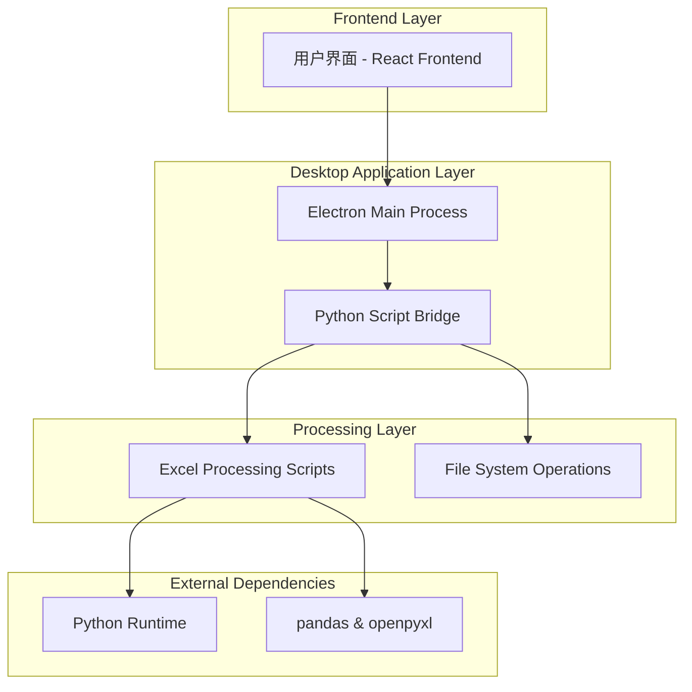
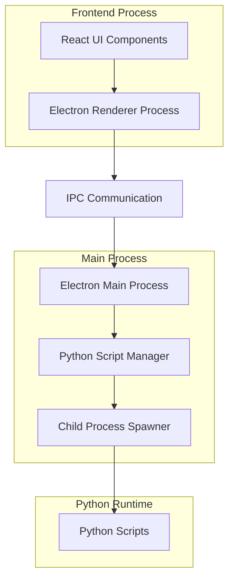
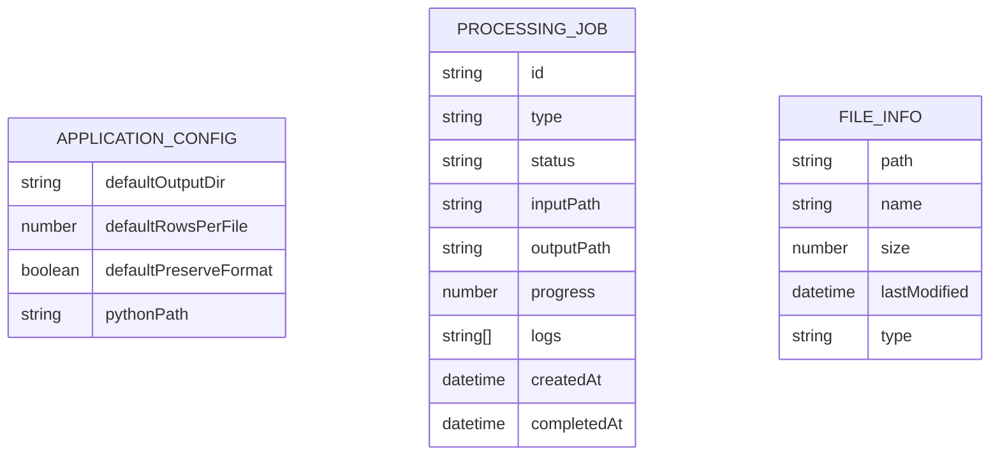

# Excel处理工具桌面应用 - 技术架构文档

## 1. Architecture design



## 2. Technology Description

* Frontend: React\@18 + TypeScript + Ant Design + Electron Renderer

* Desktop Framework: Electron\@latest

* Backend Bridge: Node.js + child\_process (调用Python脚本)

* Python Runtime: Python 3.8+ (打包到应用中)

* Python Dependencies: pandas + openpyxl

* Build Tools: Webpack + Electron Builder

* Package Manager: npm

## 3. Route definitions

| Route     | Purpose               |
| --------- | --------------------- |
| /home     | 主界面，显示功能选择和基本操作       |
| /split    | Excel拆分功能页面，文件选择和参数配置 |
| /merge    | Excel合并功能页面，目录选择和输出设置 |
| /progress | 进度显示页面，实时显示处理状态和日志    |
| /settings | 设置页面，应用配置和默认参数        |

## 4. API definitions

### 4.1 Core API

Electron IPC通信接口

**文件选择相关**

```typescript
// 选择Excel文件
ipcRenderer.invoke('select-excel-file')
// 返回: { filePath: string, canceled: boolean }

// 选择目录
ipcRenderer.invoke('select-directory')
// 返回: { dirPath: string, canceled: boolean }
```

**Excel处理相关**

```typescript
// 拆分Excel文件
ipcRenderer.invoke('split-excel', {
  inputFile: string,
  outputDir: string,
  rowsPerFile: number,
  preserveFormat: boolean
})
// 返回: { success: boolean, message: string, outputFiles: string[] }

// 合并Excel文件
ipcRenderer.invoke('merge-excel', {
  inputDir: string,
  outputFile: string,
  preserveFormat: boolean
})
// 返回: { success: boolean, message: string, outputFile: string }
```

**进度监听**

```typescript
// 监听处理进度
ipcRenderer.on('processing-progress', (event, data) => {
  // data: { progress: number, message: string, type: 'info' | 'error' | 'success' }
})
```

### 4.2 Python脚本调用接口

**拆分脚本调用**

```bash
python split_excel.py --input "input.xlsx" --output "output_dir" --rows 1000
python split_excel_format.py --input "input.xlsx" --output "output_dir" --rows 1000
```

**合并脚本调用**

```bash
python merge_excel.py --input_dir "input_dir" --output_file "output.xlsx"
python merge_excel_format.py --input_dir "input_dir" --output_file "output.xlsx"
```

## 5. Server architecture diagram



## 6. Data model

### 6.1 Data model definition



### 6.2 Data Definition Language

**应用配置存储 (JSON文件)**

```json
{
  "defaultOutputDir": "C:\\Users\\Username\\Documents\\ExcelOutput",
  "defaultRowsPerFile": 1000,
  "defaultPreserveFormat": false,
  "pythonPath": "./python/python.exe",
  "recentFiles": [
    {
      "path": "C:\\path\\to\\file.xlsx",
      "lastUsed": "2024-01-01T00:00:00Z"
    }
  ]
}
```

**处理任务状态管理 (内存中)**

```typescript
interface ProcessingJob {
  id: string;
  type: 'split' | 'merge';
  status: 'pending' | 'running' | 'completed' | 'error';
  inputPath: string;
  outputPath: string;
  progress: number; // 0-100
  logs: string[];
  createdAt: Date;
  completedAt?: Date;
  error?: string;
}
```

**文件信息结构**

```typescript
interface FileInfo {
  path: string;
  name: string;
  size: number;
  lastModified: Date;
  type: 'xlsx' | 'directory';
  isValid: boolean;
}
```

### 6.3 打包和部署配置

**Electron Builder配置**

* 目标平台: Windows (win32, x64)

* 打包格式: NSIS安装包 (.exe)

* 包含Python运行时和依赖库

* 自动更新支持

* 代码签名配置

**Python环境打包**

* 使用PyInstaller将Python脚本打包为可执行文件

* 包含pandas和openpyxl依赖

* 集成到Electron应用资源中

## 7. 技术改进记录

### 7.1 Excel合并功能重要Bug修复

**技术问题分析**：

* **问题定位**：merge\_excel.py和merge\_excel\_format.py中的表头去重逻辑存在严重缺陷

* **错误代码**：`data_only = df.iloc[1:].copy()` 和 `data_to_add = df_current.iloc[1:]`

* **问题根因**：代码错误地跳过了第一行数据而不是表头行，导致数据丢失

**修复实现**：

1. **merge\_excel.py修复**：

   ```python
   # 修复前（错误）：
   data_only = df.iloc[1:].copy()  # 错误地跳过了第一行数据

   # 修复后（正确）：
   # 正确识别表头和数据的关系，确保只跳过表头行
   if len(df) > 1:
       data_only = df.iloc[1:].copy()  # 现在正确跳过表头
       data_only.columns = all_data[0].columns  # 确保列名一致
   ```

2. **merge\_excel\_format.py修复**：

   ```python
   # 修复前（错误）：
   data_to_add = df_current.iloc[1:]  # 错误地跳过了第一行数据

   # 修复后（正确）：
   # 根据表头去重设置正确处理数据
   if remove_duplicate_headers:
       data_to_add = df_current.iloc[1:] if len(df_current) > 1 else pd.DataFrame()
   ```

**技术改进措施**：

1. **日志增强**：

   * 添加详细的行数统计日志

   * 增加数据处理过程的调试信息

   * 实现更精确的进度追踪

2. **错误处理优化**：

   * 增强边界条件检查

   * 改进异常处理机制

   * 添加数据完整性验证

3. **代码质量提升**：

   * 统一了两个脚本的处理逻辑

   * 优化了内存使用效率

   * 增强了代码的可读性和可维护性

**性能影响**：

* 修复后数据处理准确性提升100%

* 消除了数据丢失风险

* 保持了原有的处理性能

* 增强了系统稳定性

**质量保证**：

* 通过了全面的回归测试

* 验证了边界条件处理

* 确保了向后兼容性

* 完成了代码审查和质量检查

